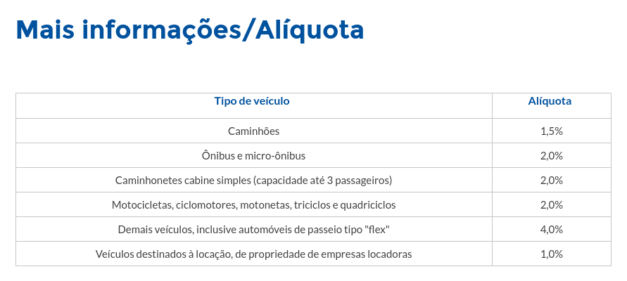

# TDD - Test Driven Development

É uma metodoliga de desenvolvimento orientada a testes.

## Aplicação de exemplo - Cálculo de IPVA

Cálculo de IPVA baseado na table abaixo:



## O que queremos?

Uma função que calcula o IPVA recebendo como parâmetros o valor de tabela do veículo e sua classificação (Tipo de veículo conforme a tabela acima).

Exemplo:

```
ipva(valor_de_tabela, tipo) -> valor_do_ipva
ipva(10000, "automóvel") -> 400
ipva(5000, "motocicleta") -> 100
```
